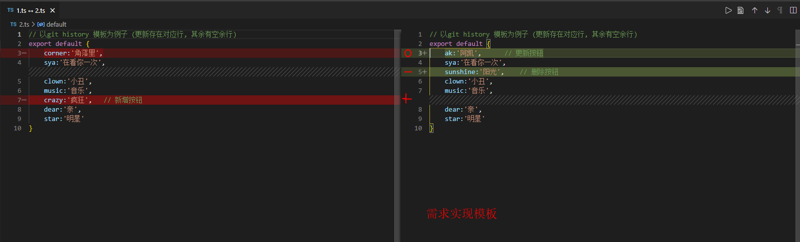

## [1.1.0] - 2021-08-24
1. [#1](https://github.com/AKclown/file-teleport/issues/1) 
    - 
2. 输入数据持久化设置
3. 复用重用逻辑 
4. 修复已开文件窗口再次打开
5. 修复: 插入的时候会多一行空格

----------------------------

### [1.0.0] - 2021-05-10
1. 更新操作  diff对比
2. 插入操作
3. 替换操作
4. 快捷键
5. 多文件配置