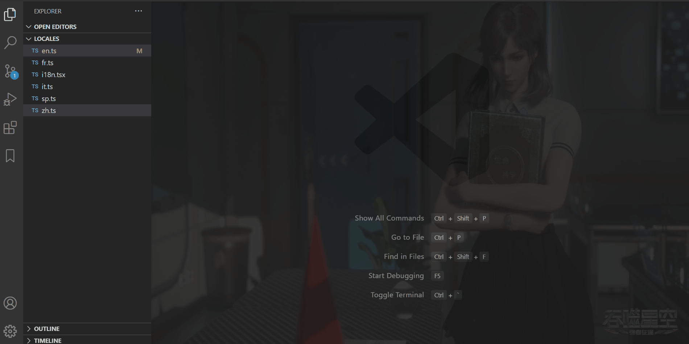
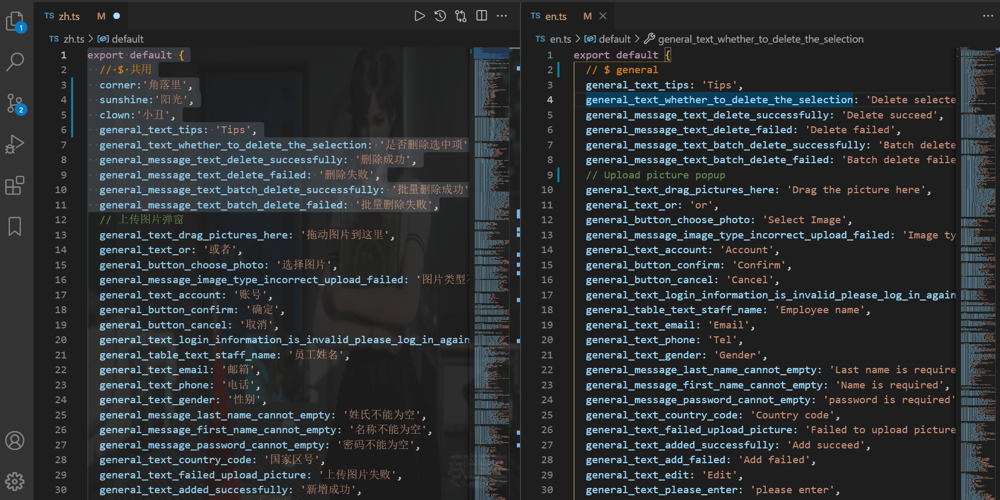
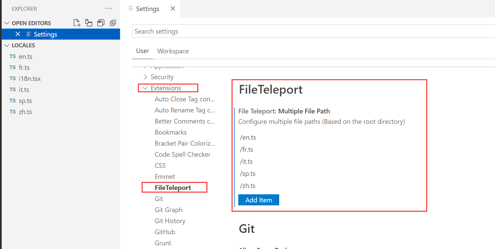
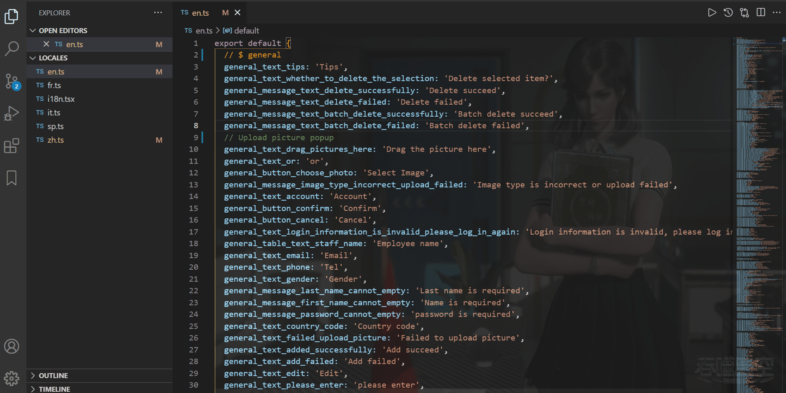

# File Teleport是干什么的？

- File Teleport是一款提高工作效率，致力于多文件信息同步，解决繁琐操作的vscode插件。设计初衷是解决国际化文件同步问题，同时适用于其他需要文件内容转移的场景。目前提供了insert、replace、update功能,update会进行文件diff匹配。下面结合国际化demo来讲解它的用法

--- 

### 三种功能的使用方法  (最左侧为源文件、其余都是目标文件)

**1. 更新操作:** 无需明确知道选择区域中做的改动，如新增、删除、不变、修改。该插件会进行diff比较，找出目标文件与源文件的不同，进行更新 

**2. 插入操作:** 将选中区域的文本插入到目标文件的任意行 

**3. 替换操作:** 将源文件选中区域文本替换掉目标区域文本 

----

### 多文件路径配置
 有时候你不想每次都去打开目标文件，此时多文件路径配置将帮你解决此问题。该功能是当你的vscode只有一个可见编辑器窗口的时候触发，路径以根目录为基准

---
### 快捷键配置
- 默认按键配置(window & mac)
1. 插入操作 `alt+r`
2. 更新操作 `alt+t`
3. 替换操作 `alt+y`

- 你也可以去快捷键设置界面进行自定义设置

PS：如果你觉得此插件对你有帮助，那就别吝啬你手里的'⭐'给[本项目start](https://github.com/AKclown/file-teleport)，你的鼓励就是对作者最大的支持，如发现bug或者交互改进都可去项目提[issue](https://github.com/AKclown/file-teleport/issues)