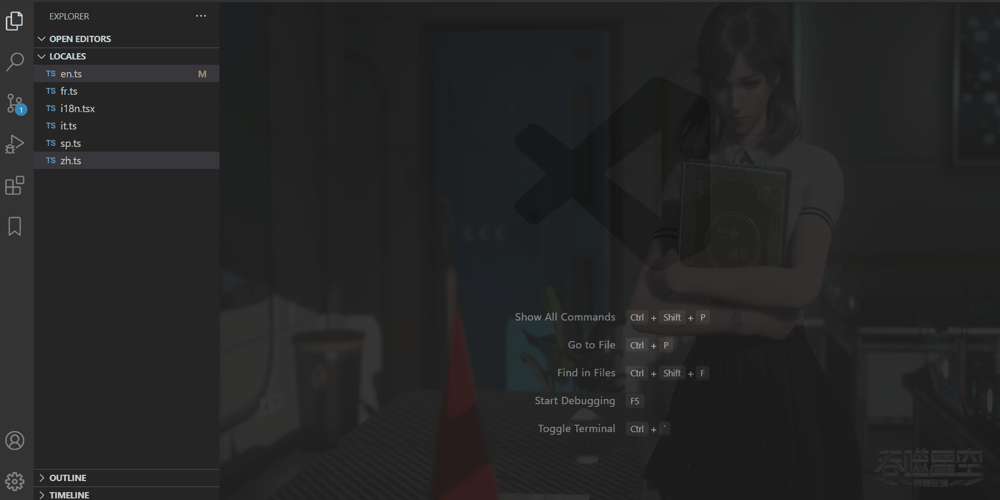
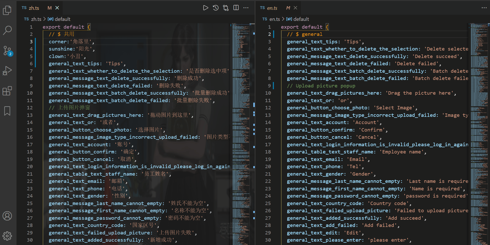
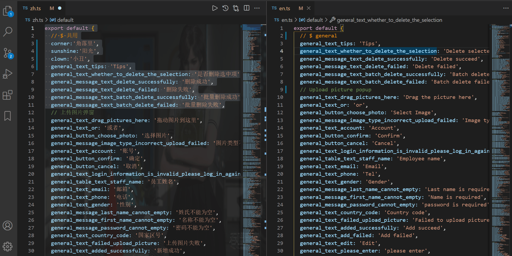
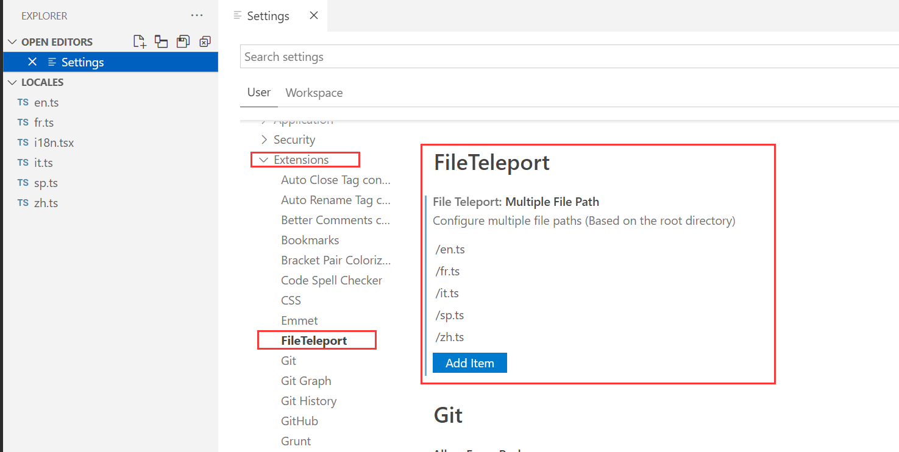
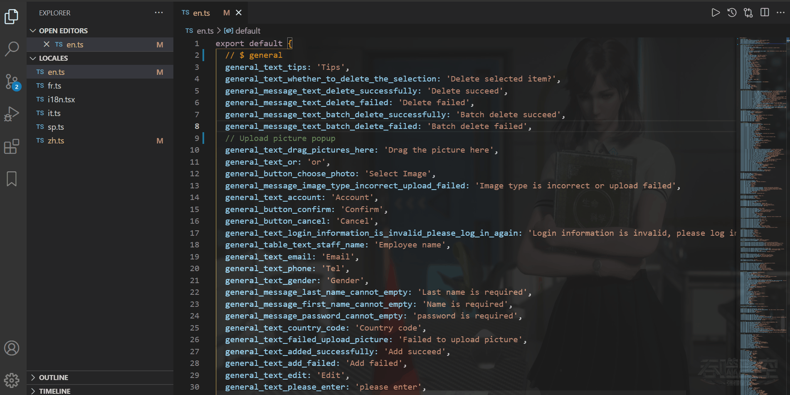

### **What is File Teleport using for?**  [中文版](./README-ZH.md)

- File Teleport is a vscode plug-in that improves work efficiency, dedicates to the synchronization of multiple file information, and solves tedious operations. The original intention of the design is to solve the problem of synchronization of international file, and it is also suitable for other scenarios that require file contents transfer. At the moment, vscode plug-in provides functions like insert, replace and update, the function update will perform file diff matching. Let's explain its usage in combination with the international demo.

--- 

### **How to use the three functions (the leftmost is the source file, the rest are the target files)**

**1. Update operation:** No need to know the changes made in the selected area, such as add, delete, remain unchanged, and modify. The plug-in will perform diff comparison, find out the difference between the target file and the source file, and update it. 

**2. Insert operation:** Insert the text in the selected area into any line of the target file.

**3.Replace operation:** Replace the text in the target area with the text in the selected area of the source file.

----

### **Multi-file path configuration.**

- Sometimes you don't want to open the target file every time. At this time, the multi-file path configuration will help you solve this problem. This function is triggered when your vscode has only one visible editor window, and the path is based on the root directory.

---

### **Keyboard shortcuts configuration.**

- Default button configuration (window & mac)
1. Insert operation `alt+r`
2. Update operation `alt+t`
3. Replacement operation `alt+y`

- You can also make customize settings in the shortcut key setting interface.

PS: If you think this plug-in is helpful to you, [don't be stingy with the'⭐' in your hand to start the project](https://github.com/AKclown/file-teleport), your encouragement is biggest support to the author. If you finds bugs or interactive improvements,you can go to the project to [raise issue](https://github.com/AKclown/file-teleport/issues).